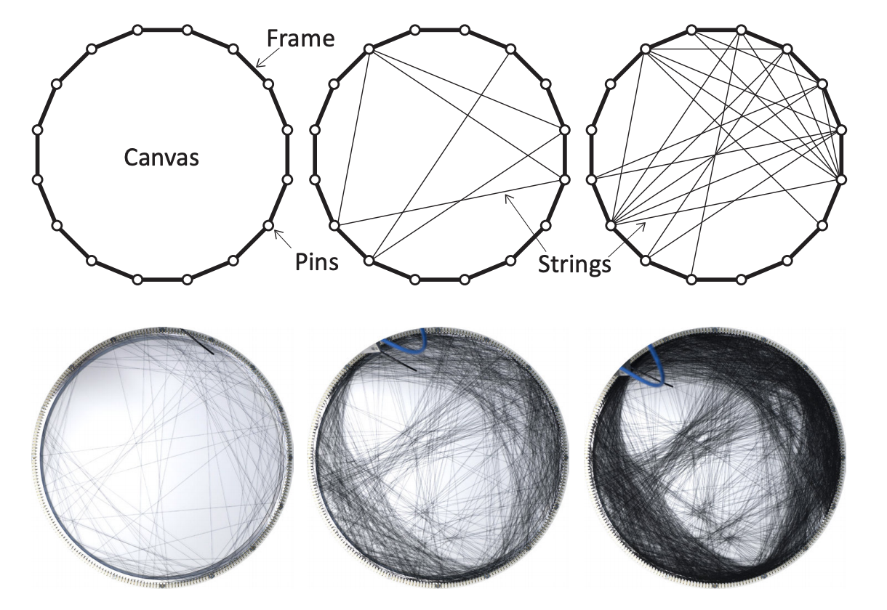
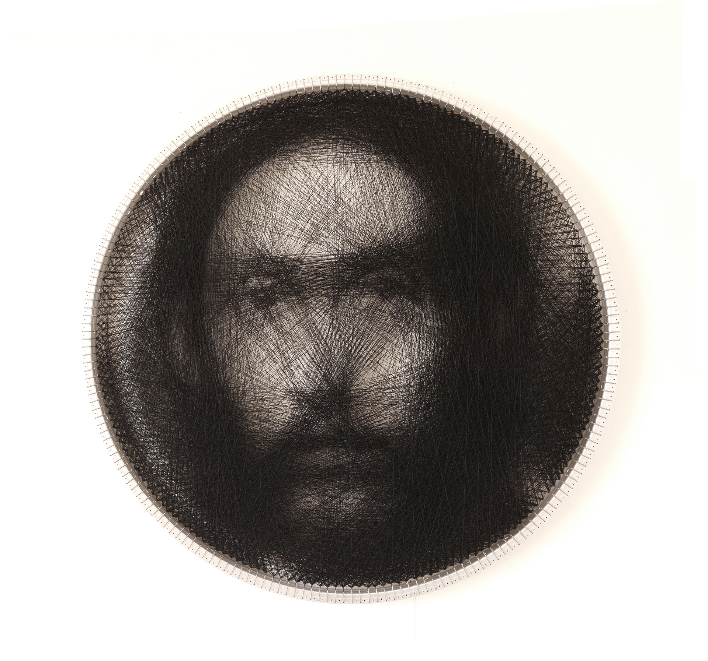

## Parallelized String Art

### Author 
Catherine Yu (tianhony) Nanxi Li (nanxil1)

### Proposal & Reports
[Proposal](https://nanxili.github.io/15418-threadart/pdf/proposal.pdf) [Checkpoint Report](https://nanxili.github.io/15418-threadart/pdf/checkpointReport.pdf) [finalReport](https://nanxili.github.io/15418-threadart/pdf/finalReport.pdf) [finalSlides](https://nanxili.github.io/15418-threadart/pdf/finalSlides.pdf) 

### Summary
String art is an image solely composed of strings between pins around a circular canvas. We implemented a parallelized string art solver in C++ and CUDA that computes the string art best resembling the input image. We developed our algorithm from scratch based on the sequential greedy approach proposed in paper by Brisak et al. We modified the proposed algorithm while implementing our sequential version of the solver, so that algorithm would have more parallelism to exploit while outputting more accurate string art image. We then developed our parallel version of the solver, which produces the same output as the sequential solver in a considerably shorter runtime. We were able to achieve an over 221x speedup on a 512*512 image with 128 pins. 

See [finalReport](https://nanxili.github.io/15418-threadart/pdf/finalReport.pdf) for more information.

### Background
First of all, what is string art? String art is a technique for the creation of visual artwork where images emerge from a set of strings that are spanned between pins. It is traditionally done with strings wounding around a grid of nails hammered into a velvet-covered wooden board. Here is a [video](https://vimeo.com/175653201) explaining how it is done.

We are going to use the algorithm presented by [Birsak et al](https://www.cg.tuwien.ac.at/research/publications/2018/Birsak2018-SA/Birsak2018-SA-preprint.pdf) in his research paper. This algorithm will not produce a solution using a single continuous thread, but many discrete edges. 

### References
Michael Birsak et al. “String art: towards computational fabrication of string images”. In:ComputerGraphics Forum. Vol. 37. 2. Wiley Online Library. 2018, pp. 263–274 [link](https://www.cg.tuwien.ac.at/research/publications/2018/Birsak2018-SA/Birsak2018-SA-preprint.pdf)

Exception1984. Exception1984/StringArt. [link](https://github.com/Exception1984/StringArt).

Jblezoray. jblezoray/stringart. [link](https://github.com/jblezoray/stringart)

petros vrellis petros. A new way to knit (2016). [link](http://artof01.com/vrellis/works/knit.html)
